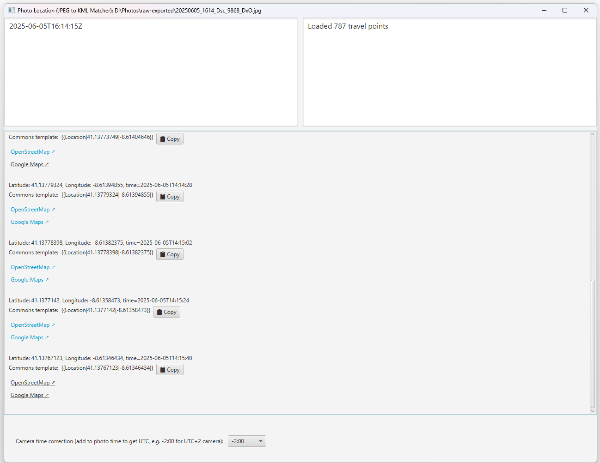

## Photo Location Finder: JPEG to KML Matcher
This application is purpose-built to assist in uploading images to Wikimedia Commons,
where specifying the precise location of the photo's origin can be essential.

Initially, I developed this software to streamline my own workflow. Manually identifying and inputting
the location was cumbersome and time-consuming. To optimize this process, I utilized the Android
application [Geo Tracker](https://play.google.com/store/apps/details?id=com.ilyabogdanovich.geotracker&hl=en),
developed by Ilia Bogdanovich, to track my routes and subsequently export them to KML files.

The software I've developed facilitates a more efficient search through these KML files, significantly simplifying
and speeding up the task of pinpointing photo locations.

### Screenshot



### How It Works
* **Platform:** It's a desktop application developed using JavaFX.
* **Prerequisites:** Users need to have the [Java FX SDK](https://openjfx.io/) installed, and Java 17 is also required.
* **Application Interface:**
  * The first text field accepts a JPEG file via drag and drop. Once a valid file is uploaded,
  the application extracts the original creation timestamp from its EXIF metadata.
  * The second field is for a KML file. Upon dragging and dropping a valid KML file,
  the app fetches the entire route - pinpointing locations at specific timestamps.
  * The output panel displays the search result as a rich interactive view with clickable links
  and copy buttons. A **📄 Copy all as text** button at the top copies the full result to the clipboard.
* **Output Information:**
  * The application offers the last recorded point before the photo was taken.
  I noticed that Geo Tracker doesn't record a new point until there's movement.
  Given that most photos are taken while stationary, this data is crucial.
  * It also provides the point closest in time to when the photo was taken (either before
  or after the shot).
  * Points where no movement was detected by Geo Tracker for over 10 seconds, termed as "stop points," are identified.
  These are sought within a time frame of 2 minutes before and after the photo was clicked.
  * Each of the mentioned points includes latitude and longitude, a **Commons template** (with a copy button),
  and clickable links to OpenStreetMap and Google Maps.
* **Time Adjustment Feature:** the timestamp extracted from the JPEG might often be in an incorrect timezone.
To rectify this, there's an option to adjust the timestamp relative to UTC — this value is *added* to the
photo timestamp, so it is the inverse of the camera's timezone. For instance, when I take photos
in Poland during summer (observing Central European Summer Time, UTC+2), I set the adjustment to -2:00.

For the effective use of this application, it's crucial to synchronize the time of the camera
with the time on the phone. Only then can the photo's precise location be accurately determined.

### Disclaimer:
This particular application was crafted primarily for personal use. It has undergone testing only with KML
files produced by Geo Tracker. Users who opt to utilize this tool should be aware that it hasn't
been subjected to extensive commercial-grade testing. I've made it available, hoping it might be beneficial
to others. However, those who use it should proceed cautiously and be mindful of its limitations.

### Licensing:
The application's code is available under the Apache License, Version 2.0, January 2004.

### Building the project
```
./gradlew shadowJar
```

### Building a GraalVM native image

Native-image builds require a separate [GraalVM installation supported by
GluonFX](https://docs.gluonhq.com/#_platforms); a regular JDK is not sufficient. Download and extract the
GraalVM archive for the host operating system. `GRAALVM_HOME` must point to the extracted JDK directory that
contains `bin/native-image` (`bin/native-image.cmd` on Windows).

Native images are platform-specific, so configure and build on each target operating system:

* **Linux:** install the compiler and libraries listed in the GluonFX platform requirements, then run:
  ```shell
  export GRAALVM_HOME=/path/to/graalvm
  export PATH="$GRAALVM_HOME/bin:$PATH"
  native-image --version
  ./gradlew :app:nativeBuild
  ```
* **macOS:** install the Xcode command-line tools with `xcode-select --install`, then run:
  ```shell
  export GRAALVM_HOME=/path/to/graalvm/Contents/Home
  export PATH="$GRAALVM_HOME/bin:$PATH"
  native-image --version
  ./gradlew :app:nativeBuild
  ```
* **Windows:** GraalVM needs Microsoft's C/C++ compiler to create an `.exe`. The full Visual Studio IDE is
  optional; either **Visual Studio Community** or the smaller **Build Tools for Visual Studio** package works.

  1. If neither is installed, follow Microsoft's
     [MSVC installation instructions](https://learn.microsoft.com/en-us/cpp/overview/acquire-msvc?view=msvc-170)
     to download and start **Visual Studio Installer**.
  2. In Windows Start, search for and open **Visual Studio Installer**. Find the installed Visual Studio or
     Build Tools entry and click **Modify**. For a new installation, continue from the install screen instead.
  3. In **Workloads**, select **Desktop development with C++**. In **Installation details**, ensure the C++
     x64/x86 build tools and a **Windows 11 SDK** are selected, then click **Install** or **Modify**. The exact
     MSVC version name depends on the installed Visual Studio release.
  4. From Windows Start, open **x64 Native Tools Command Prompt** for that Visual Studio release, for example
     **x64 Native Tools Command Prompt for VS 2022**. This is Command Prompt with `cl.exe` and `link.exe`
     configured; an ordinary Command Prompt does not configure them automatically.

  In that prompt, run:

  ```batch
  set GRAALVM_HOME=C:\path\to\graalvm
  set PATH=%GRAALVM_HOME%\bin;%PATH%
  where cl
  where link
  native-image.cmd --version
  gradlew.bat :app:nativeBuild
  ```
  Both `where` commands must print a file path before starting the Gradle build.

The executable is written below `app/build/gluonfx/<architecture>-<os>/`. Run it directly or use
`./gradlew :app:nativeRun` (`gradlew.bat :app:nativeRun` on Windows).

If a new dependency or file format uses reflection or resources that GraalVM cannot discover statically, run
`./gradlew :app:nativeRunAgent` (`gradlew.bat :app:nativeRunAgent` on Windows). In the opened application,
exercise every relevant workflow with representative JPEG, RAW, and KML files, then close it. Review and commit
the configuration generated under `app/src/main/resources/META-INF/native-image/`, then rebuild with
`:app:nativeBuild`. The agent records only the code paths exercised during that run.

### Binary version
* If you don't want to build the application yourself, you can use the JAR file built by me, [available here](https://drive.google.com/drive/folders/1_c_1Wsqzidcj243XkCU99KZyPhaLlgRO?usp=sharing).
* You still need [Java, in version 17 at least](https://www.oracle.com/java/technologies/downloads/#java17), installed in your system. If the application does not start, download and install a newer Java version first.
* Run the downloaded JAR file from a terminal with:
  ```
  java -jar photo-location.jar
  ```
  Replace `photo-location.jar` with the actual downloaded file name.
* On Windows, you can use `javaw` to start the application without keeping a console window open:
  ```
  javaw -jar photo-location.jar
  ```
